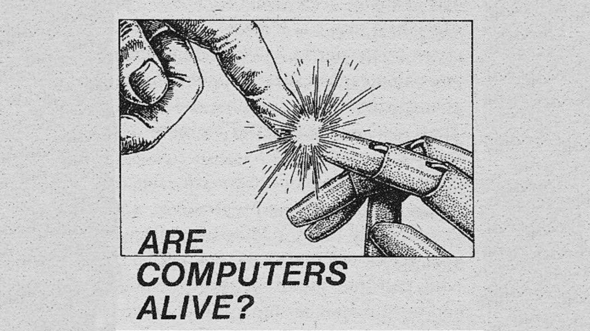

<h1> Hey there, I'm Mai :) </h1>
<h3 align="center"> ☆ A developer, IT technician and I’m also studying a bachelor’s degree in physics at UFSM ☆ </h3>
 

 

 
  
  
  
  
  
  
  
  
  
  
  
  
  
  
  
  

 
  
 

**𝘛𝘢𝘭𝘬𝘪𝘯𝘨 𝘢𝘣𝘰𝘶𝘵 𝘱𝘦𝘳𝘴𝘰𝘯𝘢𝘭 𝘴𝘵𝘶𝘧𝘧:**

✮ 𝘐'𝘮 21𝘺𝘰 𝘢𝘯𝘥 𝘮𝘺 𝘣𝘪𝘳𝘵𝘩𝘥𝘢𝘺 𝘪𝘴 𝘑𝘢𝘯𝘶𝘢𝘳𝘺 24𝘵𝘩

✮ 𝘐 𝘩𝘢𝘷𝘦 𝘢 𝘤𝘢𝘵 (𝘑𝘰𝘯𝘢𝘴) 𝘢𝘯𝘥 𝘢 𝘥𝘰𝘨 (𝘓𝘦𝘴𝘴𝘪𝘦).

✮ 𝘔𝘺 𝘧𝘢𝘷𝘰𝘳𝘪𝘵𝘦 𝘨𝘢𝘮𝘦 𝘪𝘴 𝘙𝘶𝘯𝘦𝘴𝘤𝘢𝘱𝘦 (𝘣𝘵𝘸 𝘮𝘺 𝘯𝘪𝘤𝘬𝘯𝘢𝘮𝘦 𝘪𝘴 𝘮𝘢𝘪𝘵𝘩𝘸)

✮ 𝘐'𝘮 𝘭𝘦𝘢𝘳𝘯𝘪𝘯𝘨 𝘎𝘦𝘳𝘮𝘢𝘯 𝘢𝘯𝘥 𝘙𝘶𝘴𝘴𝘪𝘢𝘯.

✮ 𝘐 𝘭𝘪𝘬𝘦 𝘩𝘪𝘬𝘪𝘯𝘨 𝘢𝘯𝘥 𝘤𝘢𝘮𝘱𝘪𝘯𝘨. 

✮ 𝘔𝘺 𝘔𝘉𝘛𝘐 𝘱𝘦𝘳𝘴𝘰𝘯𝘢𝘭𝘪𝘵𝘺 𝘪𝘴 𝘌𝘕𝘛𝘗.

✮ 𝘐 𝘶𝘴𝘦𝘥 𝘵𝘰 𝘥𝘳𝘦𝘢𝘮 𝘰𝘧 𝘣𝘦𝘪𝘯𝘨 𝘢𝘯 𝘢𝘤𝘵𝘳𝘦𝘴𝘴 𝘰𝘳 𝘢𝘯 𝘢𝘳𝘤𝘩𝘪𝘵𝘦𝘤𝘵, 𝘣𝘶𝘵 𝘐 
𝘧𝘦𝘭𝘭 𝘪𝘯 𝘭𝘰𝘷𝘦 𝘸𝘪𝘵𝘩 𝘱𝘳𝘰𝘨𝘳𝘢𝘮𝘮𝘪𝘯𝘨 𝘢𝘯𝘥 𝘱𝘩𝘺𝘴𝘪𝘤𝘴.

✮ 𝘎𝘰𝘪𝘯𝘨 𝘵𝘰 𝘵𝘩𝘦 𝘨𝘺𝘮 𝘪𝘴 𝘮𝘺 𝘵𝘩𝘦𝘳𝘢𝘱𝘺. 

✮ 𝘛𝘩𝘦 𝘮𝘶𝘴𝘪𝘤 𝘨𝘦𝘯𝘳𝘦𝘴 𝘐 𝘭𝘪𝘴𝘵𝘦𝘯 𝘵𝘰 𝘵𝘩𝘦 𝘮𝘰𝘴𝘵 𝘢𝘳𝘦 𝘱𝘰𝘴𝘵 𝘱𝘶𝘯𝘬, 𝘴𝘩𝘰𝘦𝘨𝘢𝘻𝘦, 𝘱𝘰𝘱 𝘱𝘶𝘯𝘬 𝘢𝘯𝘥 𝘵𝘦𝘤𝘩𝘯𝘰.

    

 

✧⋄⋆⋅⋆⋄✧⋄⋆⋅⋆⋄✧✧⋄⋆⋅⋆⋄✧⋄⋆⋅⋆⋄✧✧⋄⋆⋅⋆⋄✧⋄⋆⋅⋆⋄✧✧⋄⋆⋅⋆⋄✧⋄⋆⋅⋆⋄✧✧⋄⋆⋅⋆⋄✧⋄⋆⋅⋆⋄✧✧⋄⋆⋅⋆✧

 

 

